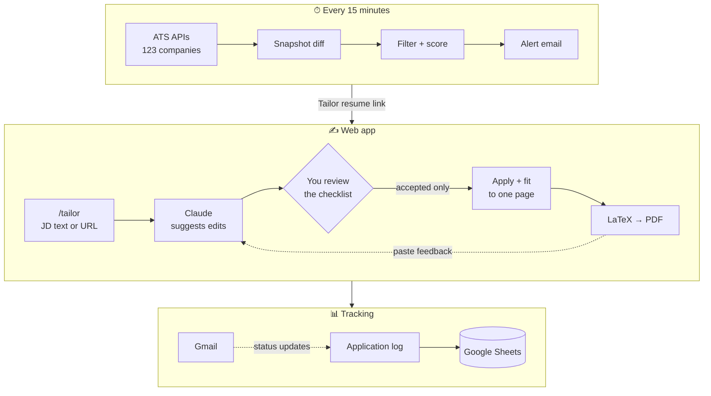
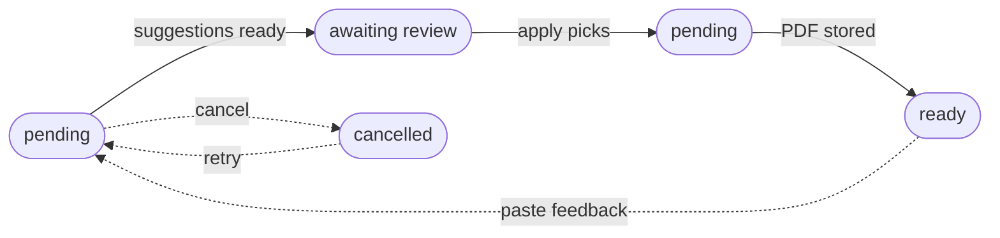

<div align="center">

# AI Job Hunting Agent

**Watches 120+ company career pages around the clock, emails me the moment a relevant role opens, and tailors my resume to it — with every edit approved by me.**


-008080?logo=latex&logoColor=white)


</div>

---

## Why

New-grad and internship postings fill up in days. Checking dozens of career pages by hand is slow, and rewriting a resume for every role is slower. This agent does the watching and the first draft of the tailoring, and leaves the final call on every word to a human.

## Features

| | |
|---|---|
| 🔭 **Job monitoring** | Polls 123 companies every 15 minutes straight from their ATS APIs (Greenhouse, Ashby, Lever, Amazon, Goldman Sachs), diffs against the last snapshot, and scores new postings against editable title / keyword / location filters. |
| 📬 **Instant alerts** | One email per batch of new roles, each with a **Tailor resume** link that opens the web app pre-filled. |
| ✍️ **Suggest-and-approve tailoring** | Claude proposes small keyword insertions against a fixed one-page master resume. Each suggestion is labeled *grounded* or *extrapolated*; only the ones you check off are applied. Nothing is invented, reordered, or cut. |
| 🔁 **Feedback rounds** | Paste a reviewer's or recruiter's notes onto a finished resume and get another reviewable batch of edits that stacks on the last one. |
| 🔗 **Paste a link, get the JD** | Job URLs are fetched (Cheerio, falling back to Playwright), cleaned with Mozilla Readability, stripped of benefits/EEO boilerplate, and auto-fill title, company, and location. SSRF-guarded. |
| 📄 **Pixel-perfect PDFs** | Markdown → LaTeX → PDF via Tectonic and a custom `czresume.cls` template. ATS-safe, one page, with an overflow warning on the master resume. |
| 📊 **Application tracking** | Log applications from the app; every row syncs to Google Sheets. |
| 📥 **Gmail status ingestion** *(opt-in)* | Reads recruiter emails, classifies them with the LLM, matches them to an application, and moves its status forward (assessment → interviewing → offer), notifying on the ones that matter. |
| 🔒 **Private by default** | Google sign-in restricted to one email; the agent API is reachable only through the web app's server-side proxy. A public `/playground` demos the tailoring flow. |

## How it works



### The tailoring pipeline

LLM calls can outlast Railway's ~300s edge timeout, so every generation runs as a background job that the editor polls, and every run can be cancelled — the spawned `claude` process is actually killed, not just ignored.



## Tech stack

| Layer | Tools |
|---|---|
| **Frontend** | Next.js 16 (App Router), TypeScript, Tailwind CSS |
| **Backend** | Node.js, Express, PostgreSQL, node-cron |
| **AI** | Claude via the headless `claude -p` CLI (OpenAI GPT-4o fallback), Zod-validated output |
| **Scraping** | Direct ATS APIs for monitoring; Cheerio + Playwright + Readability for JD fetch |
| **PDF** | Tectonic (LaTeX) with a custom `czresume.cls` class |
| **Integrations** | Resend (email), Google Sheets API v4, Gmail API |
| **Auth** | Auth.js (Google OAuth), single-email allowlist, shared-secret BFF proxy |
| **Infra** | Railway (production + staging), Docker Compose for local Postgres |

## Getting started

### Prerequisites

- Node.js 18+ and Docker
- [Tectonic](https://tectonic-typesetting.github.io/) and Poppler — `brew install tectonic poppler`
- A Claude subscription token (`claude setup-token`) — or an OpenAI key with `LLM_PROVIDER=openai`
- A [Resend](https://resend.com) API key and a Google service account with Sheets access

### Run locally

```bash
npm install
docker-compose up -d          # Postgres
cp .env.example .env          # fill in your keys

npm run dev:agent             # API + cron scheduler → localhost:3001
npm run dev:web               # web app → localhost:3000
```

### Tests

```bash
npm test                      # fast unit tests — no DB, LLM, or network
npm run test:integration      # needs live Postgres, an LLM, and Tectonic
```

### Configuration

Every variable is documented in [`.env.example`](.env.example). The essentials:

| Variable | Purpose |
|---|---|
| `DATABASE_URL` | Postgres connection string |
| `CLAUDE_CODE_OAUTH_TOKEN` | Claude CLI auth (default LLM provider) |
| `RESEND_API_KEY`, `YOUR_EMAIL` | Alert and "Email to me" delivery |
| `GOOGLE_SHEETS_SPREADSHEET_ID`, `GOOGLE_SERVICE_ACCOUNT_JSON` | Application log sync |
| `AUTH_SECRET`, `GOOGLE_CLIENT_ID`, `GOOGLE_CLIENT_SECRET`, `AUTH_ALLOWED_EMAIL` | Sign-in |
| `INTERNAL_API_SECRET` | Shared secret between the web proxy and the agent API |
| `JOB_ALERTS_ENABLED` | Set `false` on staging/local so only one environment emails you |
| `GMAIL_INGEST_ENABLED` | Set `true` to turn on Gmail status ingestion |

## Project structure

```
├── packages/
│   ├── agent/                 # Express API, scraper, AI pipeline, cron
│   │   └── src/
│   │       ├── scraper/       # ATS adapters, diffing, filters, JD fetch
│   │       ├── ai/            # suggestions, apply, fit-to-page, PDF render, LLM clients
│   │       ├── ingest/        # Gmail classification + application matching
│   │       ├── api/routes/    # tailor, resumes, master-resume, applied, preferences
│   │       ├── integrations/  # Google Sheets, Gmail
│   │       ├── notifications/ # Resend emails
│   │       └── db/            # schema + queries
│   └── web/                   # Next.js app — dashboard, tailor, editor, master resume, applied, preferences
├── Resume_Template/           # czresume.cls LaTeX template + font cache warm-up
├── Dockerfile                 # agent service
└── Dockerfile.web             # web service
```

## Deployment

Two Railway services built from the same repo — `agent` (`Dockerfile`) and `web` (`Dockerfile.web`) — in separate production and staging environments, each with its own Postgres. Merges to `main` auto-deploy. The Docker image pre-warms Tectonic's font cache at build time so the first PDF render in a fresh container doesn't depend on a rate-limited CDN.

Set `AGENT_API_URL` on `web` to the agent's URL (with `/api`), `WEB_URL` on `agent` to the web URL, and the same `INTERNAL_API_SECRET` on both. Auth variables (`AUTH_*`, `GOOGLE_CLIENT_*`) go on `web` only; Railway also needs `AUTH_TRUST_HOST=true` and an explicit `AUTH_URL`.

## Design decisions

**Suggest-and-approve over generate → critique → revise.** An earlier version rewrote the whole resume in an AI loop. Quality was inconsistent and no bullet was guaranteed to survive untouched. Now a single call proposes discrete, labeled edits against a fixed master resume, and only approved ones are applied — trading AI polish for the guarantee that nothing changes without a human saying yes.

**The master resume is the only source of truth.** The model may rephrase and select facts that exist in it, never invent new ones. Groundedness is labeled deterministically, not by the model: a suggestion whose keyword appears nowhere in the master resume, or that adds a number its source bullet doesn't contain, is flagged *extrapolated* before it ever reaches the checklist.

**No RAG.** The master resume fits in a single prompt; embeddings and retrieval would add moving parts with no benefit at this size.

**Claude CLI instead of the metered API.** Tailoring runs through headless `claude -p` on a subscription token. Both providers sit behind one `completeJSON()` interface, so switching to OpenAI is an env var.

**Background jobs, no queue.** Generation is async with DB-row status and polling; cron runs in-process with overlap guards. A Redis/BullMQ layer was deliberately left out as unnecessary for a single-user system.

**Private API behind a BFF.** The browser never talks to the agent API. The Next.js server proxies every call and attaches a shared secret the API requires, so a leaked API URL is useless on its own.
